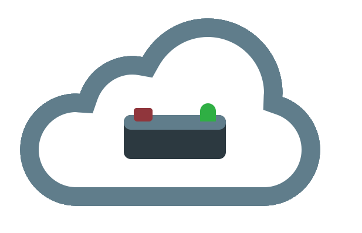

# Neg 5 : Quizbowl for the Cloud



Neg 5 is a web based quizbowl tournament management system. It 
enables tournament directors to add collaborators to their tournaments for
real-time tournament management. This ranges from managing teams and players to
submitting match scoresheets electronically. Transitioning quizbowl to a
cloud-based system has the potential to **drastically** reduce tournament waiting
times, expediting the entire process.

[Try it out](http://neg5.org) at your next tournament! 

Neg 5 is currently in the last stages of a transition phase to the next version. I've been
changing the entire application and there's still a bit of work
to do, but it's getting closer every day!

## Current Features
- Support for standard ACF and NAQT quizbowl tournament formats
- Infinite number of collaborators at admin or non-admin levels
- Team and player management
- Manual match entry
- Self-updating electronic scoresheets for match entry
- Realtime statistics
- And more!

## Upcoming Features
- Support for hsquizbowl.org database upload
- Eventual support for NAQT QBJ export
- Realtime protest handling
- Tournament chat
- Built in timer for timed matches

I'd love to hear your ideas on what you'd like the application to support!

# Contributing

If you're interested in contributing to Neg 5's development, please see the
[Getting Started](docs/getting_started.md) guide.

# Documentation

Neg 5's documentation can be found in the ```docs``` directory in this Github repo. The
SQL database schema is under ```docs/database```. 

# License

[MIT](LICENSE.md)


